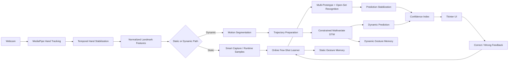

# Adaptive Real-Time Hand Gesture Recognition

A real-time, user-adaptive hand gesture recognition system built around **online few-shot learning**. Users can teach new static and dynamic gestures during runtime, correct mistakes through feedback, and preserve learned gesture memory across sessions without retraining a global classifier or storing raw video.

## Highlights

- Runtime **few-shot learning** for new user-defined static gestures
- **Smart Capture** that keeps informative samples and rejects unstable/duplicate frames
- Translation- and scale-normalized 3D hand-landmark features
- One-hand and two-hand gesture support
- Adaptive **multi-prototype** class representations
- Open-set recognition with an explicit **UNKNOWN** state
- Positive feedback and **hard-negative** correction learning
- Prediction stabilization to reduce frame-to-frame label flicker
- Live-taught **dynamic gestures** using landmark trajectories and constrained multivariate DTW
- Confidence index for static and dynamic predictions
- Persistent landmark-only gesture memory
- Rename, delete, improve, retrain, and clear gesture-management operations
- Polished Tkinter desktop interface

## Research Idea

The project investigates whether a gesture recognizer can learn and adapt interactively from only a small number of live demonstrations instead of depending on a fixed offline image/video dataset and full retraining cycles.

The static path represents a gesture class with a bounded set of positive exemplars, adaptive prototypes, local class radii, and hard-negative examples. The dynamic path represents a gesture as a temporal trajectory of normalized hand-shape and motion features and compares demonstrations using Dynamic Time Warping (DTW).

## Architecture



## Core Recognition Pipeline

### Static gestures

1. MediaPipe returns up to 21 three-dimensional landmarks per detected hand.
2. Landmarks are translated relative to the wrist and normalized by palm scale.
3. One-hand gestures use a 63-dimensional feature vector.
4. Two-hand gestures combine both 63-dimensional hand representations with relative wrist geometry.
5. Smart Capture keeps only stable and sufficiently distinct examples.
6. The online learner constructs robust prototypes and local acceptance regions.
7. A new observation is compared with learned positive exemplars/prototypes.
8. Observations outside learned regions are rejected as `UNKNOWN`.
9. User feedback can add positive evidence or hard-negative evidence immediately.

### Dynamic gestures

1. Stabilized hand landmarks are sampled over time.
2. Motion onset and offset are segmented automatically during recognition.
3. Each demonstration is converted to a normalized temporal representation containing hand shape, wrist trajectory, and velocity information.
4. Trajectories are smoothed and temporally resampled.
5. Recognition uses constrained multivariate Dynamic Time Warping.
6. Distance thresholds and ambiguity checks determine whether a trajectory is accepted or rejected as `UNKNOWN`.

## Privacy-Oriented Storage

The adaptive memory stores numerical landmark features and landmark trajectories only. The application does not intentionally persist webcam images or recorded video.

Runtime files are created locally under:

```text
data/
├── gesture_memory.json
└── dynamic_gesture_memory.json
```

These files are ignored by Git because they are user-specific learned memory.

## Repository Structure

```text
.
├── pyproject.toml
├── uv.lock
├── README.md
├── scripts/
│   ├── interactive_online_learning.py
│   ├── test_confidence_scoring.py
│   └── test_dynamic_gesture_engine.py
├── src/
│   └── adaptive_gesture/
│       ├── features/
│       │   ├── normalizer.py
│       │   ├── similarity.py
│       │   ├── hand_features.py
│       │   └── dynamic_features.py
│       ├── learning/
│       │   ├── online_learner.py
│       │   ├── sample_selector.py
│       │   ├── prediction_stabilizer.py
│       │   ├── confidence.py
│       │   ├── motion_segmenter.py
│       │   ├── dtw.py
│       │   └── dynamic_learner.py
│       ├── storage/
│       │   ├── gesture_store.py
│       │   └── dynamic_gesture_store.py
│       ├── tracking/
│       │   └── hand_tracker.py
│       └── utils/
│           └── logging_config.py
└── tests/
    ├── test_features.py
    ├── test_online_learner.py
    ├── test_prediction_stabilizer.py
    ├── test_dynamic_learner.py
    └── test_persistence.py
```

## Requirements

- Windows 10/11 recommended for the current camera backend
- Webcam
- Python **3.11**
- [`uv`](https://docs.astral.sh/uv/)

The project intentionally pins the working Python and library versions in `pyproject.toml` and `uv.lock` for reproducibility.

## Setup with `uv`

From the repository root:

```powershell
uv python install 3.11.9
uv sync --extra dev
```

`uv sync` creates/updates `.venv` automatically and installs the exact project dependencies.

## Run the Application

The preferred command does not require manual virtual-environment activation:

```powershell
uv run python scripts\interactive_online_learning.py
```

If the environment is already activated, this also works:

```powershell
python scripts\interactive_online_learning.py
```

## Basic Usage

### Teach a static gesture

1. Open **Teach**.
2. Enter a gesture name.
3. Start teaching and hold the intended pose naturally.
4. Smart Capture automatically selects useful examples.
5. The class becomes available immediately after learning completes.

### Correct a prediction

On the **Live** screen:

- Choose **Correct** to reinforce a correct known prediction.
- Choose **Wrong** to select the actual known gesture or mark the pose as unknown.

Corrections update the adaptive memory immediately; no global retraining or restart is required.

### Teach a dynamic gesture

1. Open the **Dynamic** section.
2. Enter a gesture name.
3. Record the requested live demonstrations using **Start Demo** and **Stop Demo**.
4. Perform one complete movement per demonstration.
5. The stored representation contains landmark trajectories, not video.

### Manage learned gestures

The gesture library supports operations such as:

- Improve
- Retrain
- Rename
- Delete
- Clear memory

## Testing

Run the complete automated test suite:

```powershell
uv run pytest
```

Optional focused smoke tests:

```powershell
uv run python scripts\test_confidence_scoring.py
uv run python scripts\test_dynamic_gesture_engine.py
```

The automated tests are deliberately webcam-independent so core learning, feature, DTW, stabilization, and persistence logic can be checked in CI.

## Logging and Error Diagnostics

Application logs are written to:

```text
logs/adaptive_gesture.log
```

The log uses rotation to avoid unbounded file growth. Runtime logs are ignored by Git.

If the UI reports a persistence, camera, or unexpected runtime error, this log is the first place to inspect.

## Development Workflow

Recommended before committing changes:

```powershell
uv run pytest
git status
```

User-specific gesture memory under `data/`, virtual environments, caches, logs, and hotfix archives are excluded by `.gitignore`.

## Technical Notes

The application performs **online adaptation**, but it does not retrain MediaPipe or run neural-network backpropagation when a new gesture is added. MediaPipe acts as the pretrained landmark extractor. The adaptive learner operates on the resulting normalized landmark representations.

The confidence value displayed by the application is a **confidence index**, not a calibrated statistical probability. It combines distance-to-boundary and class-separation evidence and should only be interpreted as a relative recognition-strength indicator until formal held-out calibration is performed.

## Current Scope

The system currently focuses on personalized real-time hand gesture recognition using a standard webcam. Its research emphasis is runtime class creation, class-incremental adaptation, open-set rejection, user feedback, and static/dynamic landmark-based recognition.
